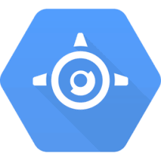

# Using Google App Engine Environments to run instances

Simple sample of a [nginx](http://nginx.org/) app that runs on [Google App Engine Managed VMs](https://cloud.google.com/appengine) using the [`nginx`](https://hub.docker.com/_/nginx/) offical Docker image.

## Details
Google app engine flexible environments provides a containers´ PAAS, taking care of many of the low level details such as:

  - Load balancer 
  - Auto scaling 
  - Service Discovery
  - Firewall rules 
  - Recycling bad application instances
  - Container logs and monitoring

Flexible environments will deploy google cloud containers, taking care of all these things for us.  To get started we only require two basic adjustments to our application: 

  - Flexible environment expects our app to serve in port `8080` by default thats why we need to modify nginx.conf file 
  - We need to create an `app.yaml` with a few basic parameters. In this case app.yaml is inside appengine-samples folder. There are two examples nginx and ruby. You can use them.

This is the app.yaml file. It´s important to notice that the first time that you deploy a container to google flexible service you cannot use service tag "service: nginx", 

```yaml
runtime: custom
vm: true
service: nginx #This is de name of the container, remove this in the first deployment
```
The file states that this is a custom runtime (built from our `Dockerfile`), that will run on a virtual machine, and the service is called `myapp`.

Additionally you would need to follow the `gcloud` tools [gcloud install process](https://cloud.google.com/sdk/downloads) for your OS, to deploy from your command line.

Let´s deploy our app 
```
$ gcloud app deploy
```
After accepting, you will see in the output that Google takes care of building your container, storing the image in your private container repository, and then using it to deploy the image on one or more virtual instances.


+ `app.yaml` - Configuration file for App Engine. This just declares the runtime is custom and to use the Dockerfile to run the application.
+ `Dockerfile` - Defines your docker image. It extends from the official nginx Docker image and adds the configuration and static files.
+ `nginx.conf` - A basic nginx configuration file.
+ `www/index.html` - Root page to be served by nginx.
